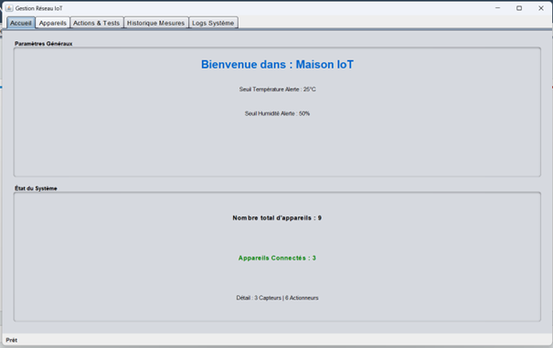
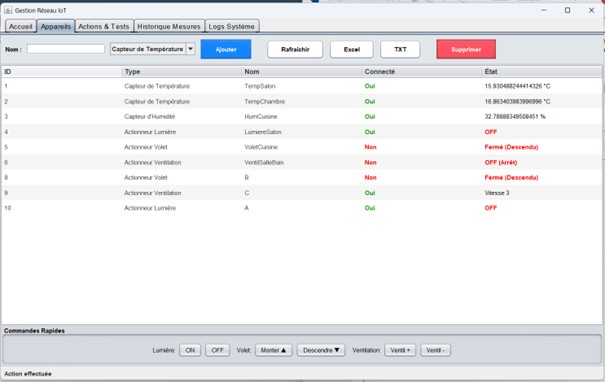
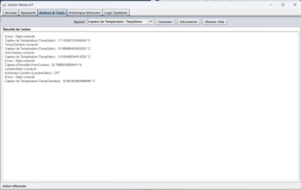
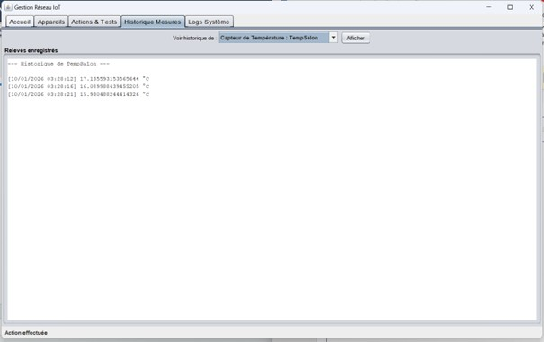
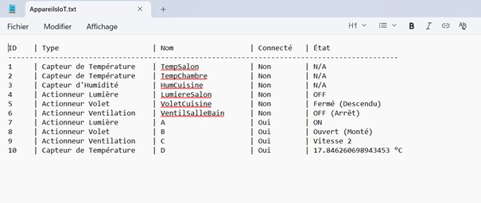
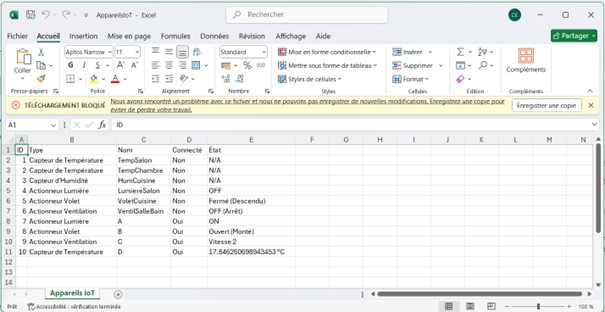
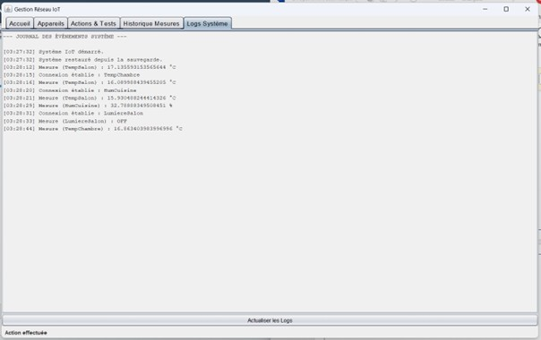

# 🏠 IoT Smart Home Manager — DashboardIoT

> **Mini-Projet Java** — ENSA d'Oujda | Filière GSEIR-4 | 2025/2026

## 📝 Description :

Application Java de gestion d'un réseau d'objets connectés (IoT) dans une maison intelligente.  
Elle permet de **centraliser le contrôle, le suivi et l'export** des données de capteurs et d'actionneurs via une interface graphique **Java Swing**, en appliquant les principes fondamentaux de la **Programmation Orientée Objet (POO)**.

## 👩‍💻 Réalisée par :

- **El Azimani Chaimae**

## 📌 Problématique :

Comment gérer de façon **uniforme** des appareils IoT très différents (capteurs, actionneurs) et assurer la **persistance et l'export** des données pour conserver l'historique et faciliter l'analyse ?

## 🎯 Objectifs Fonctionnels :

- ✅ Gérer un parc d'appareils IoT (Ajout / Suppression)
- ✅ Monitorer l'état des connexions en temps réel
- ✅ Interagir avec les appareils (Allumer, Éteindre, Faire varier des valeurs)
- ✅ Archiver les relevés de mesures (Température, Humidité, Qualité de l'air...)
- ✅ Exporter les données en format **TXT** et **Excel**

## 🏗️ Architecture Logicielle (MVC) :

Le projet suit le **pattern MVC (Model – View – Controller)** pour une séparation claire des responsabilités :

```
┌──────────────────────────────────────────────────────┐
│                   APPLICATION IoT                    │
├──────────────┬──────────────────┬────────────────────┤
│    MODEL     │   CONTROLLER     │       VIEW         │
│              │                  │                    │
│ • Appareils  │ • IoTController  │ • Interface Swing  │
│ • Capteurs   │ • ConfigLoader   │ • Tableau appareils│
│ • Actionneurs│ • ExcelExporter  │ • Logs système     │
│ • GestionIoT │ • TextExporter   │ • Historique       │
│ • Exceptions │ • LectureJSON    │                    │
│              │ • GestionPers.   │                    │
└──────────────┴──────────────────┴────────────────────┘
```

## 🛠️ Partie Matérielle — Appareils Simulés :

### 📡 Capteurs :

| Classe | Mesure | Unité |
|---|---|---|
| `CapteurTemperature` | Température ambiante | °C |
| `CapteurHumidite` | Taux d'humidité | % |
| `CapteurQualiteAir` | Indice qualité de l'air | AQI |
| `CapteurDebitEau` | Débit d'eau | L/min |

### ⚡ Actionneurs :

| Classe | Action | États |
|---|---|---|
| `ActionneurLumiere` | Contrôle éclairage | ON / OFF |
| `ActionneurVentilation` | Contrôle ventilation | Vitesse variable |
| `ActionneurVolet` | Contrôle volets | OUVERT / FERMÉ |
| `CameraIP` | Surveillance caméra | ACTIF / INACTIF |

## 💻 Partie Logicielle (Software) :

### 🧾 Technologies utilisées :

| Technologie | Rôle |
|---|---|
| **Java (POO)** | Langage principal — héritage, polymorphisme, encapsulation |
| **Java Swing** | Interface graphique (GUI) |
| **JSON** | Initialisation des appareils depuis fichier config |
| **Sérialisation Java** | Persistance des données entre sessions |
| **Apache POI / Excel** | Export des données en format Excel |
| **Java Properties** | Fichier de configuration `config.properties` |

### 📦 Structure des Packages :

```
src/
├── model/
│   ├── AppareilConnecte.java     ← Classe abstraite mère
│   ├── CapteurTemperature.java
│   ├── CapteurHumidite.java
│   ├── CapteurQualiteAir.java
│   ├── CapteurDebitEau.java
│   ├── ActionneurLumiere.java
│   ├── ActionneurVentilation.java
│   ├── ActionneurVolet.java
│   ├── CameraIP.java
│   ├── GestionIoT.java           ← Gestionnaire central
│   └── exceptions/               ← Exceptions personnalisées
├── controller/
│   ├── IoTController.java
│   ├── ConfigLoader.java
│   ├── ExcelExporter.java
│   ├── TextExporter.java
│   ├── LectureJSON.java
│   └── GestionPersistance.java
└── view/
    └── DashboardView.java        ← Interface Swing
```

## ⚙️ Logique de l'Application :

### 🔄 Démarrage :

```
[Lancement] → [Sauvegarde existante ?]
                    │ OUI → [Charger depuis fichier binaire]
                    │ NON → [Initialiser depuis JSON]
                    └──→ [Afficher interface Swing]
```

### 📊 Gestion des Appareils :

```
[Utilisateur] → [Connecter appareil]
             → [Effectuer mesure] → [Stocker dans historique]
             → [Activer actionneur] → [Modifier état courant]
             → [Consulter historique / logs]
             → [Exporter → TXT ou Excel]
```

### 🔒 Gestion des Exceptions :

| Exception | Déclencheur |
|---|---|
| `AppareilDejaConnecte` | Connexion double d'un appareil |
| `AppareilNonConnecte` | Utilisation sans connexion préalable |
| `DoublonAppareil` | Ajout d'un appareil déjà existant |
| `AppareilIntrouvable` | Référence à un appareil inexistant |

## 🔨 Interface Graphique — Démonstration :

### Tableau de bord principal :

<p align="center">
  
</p>

### Gestion des appareils :

<p align="center">
  
</p>

### Contrôle des actionneurs :

<p align="center">
  
</p>

### Historique des mesures :

<p align="center">
  
</p>

### Export des données :

<p align="center">
  
  
</p>

### Logs système :

<p align="center">
  
</p>

## 📊 Résultats :

-  Architecture MVC propre et modulaire
-  Gestion uniforme de tous types d'appareils via polymorphisme
-  Persistance des données entre sessions (sérialisation Java)
-  Export fonctionnel en TXT et Excel
-  Interface Swing intuitive et complète
-  Gestion robuste des erreurs via exceptions personnalisées

## 🚀 Améliorations Possibles :

| Amélioration | Description |
|---|---|
|  **Interface Web** | Remplacer Swing par une interface web (Spring Boot + React) |
|  **Application mobile** | App Android/iOS pour contrôler les appareils à distance |
|  **Connexion réelle** | Intégrer de vrais capteurs IoT (ESP32, Raspberry Pi) |
|  **Base de données** | Remplacer la sérialisation par MySQL / PostgreSQL |
|  **Dashboard graphique** | Ajouter des graphiques de visualisation des données |
|  **Authentification** | Système de login multi-utilisateurs avec rôles |
|  **Alertes intelligentes** | Notifications automatiques si valeur hors seuil |

## 📁 Structure du Dépôt :

```
iot-smart-home-java/
├── README.md
├── src/
│   ├── model/
│   ├── controller/
│   └── view/
├── resources/
│   ├── appareils.json         ← Config initiale des appareils
│   └── config.properties      ← Paramètres globaux
├── images/
│   ├── dashboard_demarrage.png
│   ├── dashboard_appareils.png
│   ├── dashboard_mesures.png
│   ├── dashboard_actions.png
│   ├── dashboard_historique.png
│   ├── export_donnees.png
│   └── logs_systeme.png
└── docs/
    └── rapport_java.pdf
```

## 🔑 Concepts POO Appliqués :

| Concept | Application dans le projet |
|---|---|
| **Héritage** | `CapteurTemperature`, `ActionneurLumiere`... héritent de `AppareilConnecte` |
| **Polymorphisme** | `mesurer()` redéfinie dans chaque sous-classe |
| **Encapsulation** | Attributs privés + getters/setters |
| **Abstraction** | Classe abstraite `AppareilConnecte` avec méthode abstraite `mesurer()` |
| **Exceptions** | Exceptions métier personnalisées pour chaque erreur |
| **Sérialisation** | Persistance de l'état complet via `ObjectOutputStream` |
